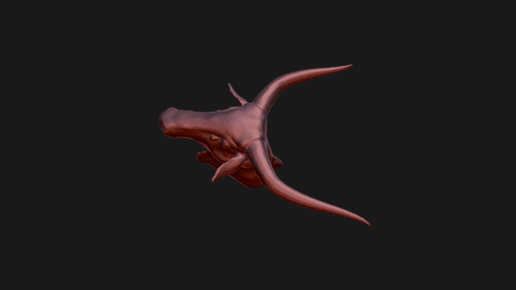

 

# africanRockArtThinkSee3D
3D rendering of animals from African Rock Art, created by ThinkSee3D on behalf of the TARA project.

Serval Cat Sculpture created by ThinkSee3D based on the Fighting Cats Rock Art in Libya. The sculpture was made as a 3D print for handling collections, specifically for blind and partially-sighted visitors.

Crying Cow 3D sculpture created by ThinkSee3D, inspired by the Crying Cows Rock Art in Algeria. The sculpture was made as a 3D print for handling collections, specifically for blind and partially-sighted visitors.

# LICENSE
The contents of this repository are licensed under CC-BY-NC-SA

# Credits
Created by ThinkSee3D.

Copyright ThinkSee3D.